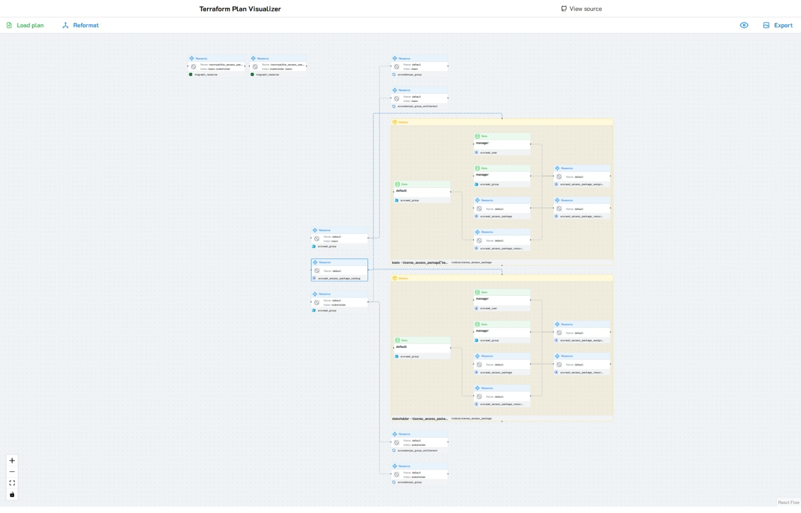

<div align="center">

# 🗺️ Terraform Plan Visualizer

### Interactive visual graph representation of your Terraform infrastructure changes

Transform complex Terraform plan files into intuitive, interactive visual graphs. Understand your infrastructure changes at a glance with a beautiful node-based visualization.



[](LICENSE)
[](package.json)

[Features](#features) • [Getting Started](#getting-started) • [Usage](#usage) • [Development](#development)

</div>

---

<div align="center">

Made with ❤️ by [joachimdalen](https://github.com/joachimdalen)

If this project helped you, please consider giving it a ⭐️! It's the only way I will be able to see the usage of this tool and how much time should be spent improving it.

</div>

---

## ✨ Features

- **🎨 Interactive Graph Visualization** - Explore your infrastructure with an intuitive node-based interface
- **📦 Resource & Module Support** - Visualize resources, data sources, and modules with distinct node types
- **🔄 Change Detection** - Instantly identify which resources will be created, updated, or destroyed
- **🔗 Relationship Mapping** - Understand dependencies and connections between resources
- **💾 Export Options** - Download your infrastructure graph as PNG og SVG for documentation and presentations
- **🎯 Interactive Node Details** - Click any node to view detailed information about the resource or change
- **📋 JSON Plan File Support** - Load standard Terraform JSON plan files directly

---

## 🚀 Getting Started

### Prerequisites

- **Node.js** 18.x or higher
- **npm** or **yarn** package manager
- **Terraform** CLI (to generate plan files)

### Installation

1. **Clone the repository**

   ```bash
   git clone https://github.com/joachimdalen/terraform-plan-visualizer.git
   cd terraform-plan-visualizer
   ```

2. **Install dependencies**

   ```bash
   npm install
   # or
   yarn install
   ```

3. **Start the development server**

   ```bash
   npm run dev
   # or
   yarn dev
   ```

4. **Open your browser**

   Navigate to `http://localhost:5173` (or the URL shown in your terminal)

### Generating a Terraform Plan File

To visualize your infrastructure, you first need to generate a Terraform plan in JSON format:

1. **Create a Terraform plan**

   ```bash
   terraform plan -out=tfplan.binary
   ```

2. **Convert the binary plan to JSON**

   ```bash
   terraform show -json tfplan.binary > plan.json
   ```

3. **Load the file**

   Click the "Load plan" button in the application and paste the contents of your `plan.json` file.

### Quick Usage

Once the application is running:

1. Click **"Load plan"** button
2. Enter your plan file in JSON format
3. Explore the graph - zoom, pan, and click nodes for details
4. Use **"Reformat"** to reorganize the layout
5. Use **"Fit view"** to center and scale the entire graph
6. Export your visualization using the download button

---

## 📖 Usage

### Understanding the Visualization

The visualizer displays your Terraform infrastructure using three types of nodes:

#### **Resource Nodes** (Blue)

Represent managed resources that Terraform will create, update, or destroy. Examples: `aws_instance`, `azurerm_virtual_machine`, `google_compute_instance`

#### **Data Source Nodes** (Green)

Represent data sources that Terraform reads from. Examples: `aws_ami`, `azurerm_resource_group`

#### **Module Nodes** (Yellow)

Represent reusable modules that contain multiple resources

### Change Type Indicators

Each node displays an icon indicating the planned action:

- **➕ Create** - Resource will be created
- **🔄 Update** - Resource will be modified in-place
- **❌ Delete** - Resource will be destroyed
- **🔁 Replace** - Resource will be deleted and recreated
- **📖 Read** - Data source will be read
- **✓ No Change** - Resource exists but no changes planned

### Settings

Click the settings icon to configure:

- Layout algorithm preferences
- Node spacing and arrangement
- Display options

---

### Built With

- **[React](https://react.dev/)** - UI framework
- **[TypeScript](https://www.typescriptlang.org/)** - Type-safe JavaScript
- **[Vite](https://vitejs.dev/)** - Build tool and dev server
- **[ReactFlow](https://reactflow.dev/)** - Graph visualization library
- **[Mantine](https://mantine.dev/)** - Component library
- **[ELK.js](https://github.com/kieler/elkjs)** - Automatic graph layout
- **[html-to-image](https://github.com/bubkoo/html-to-image)** - Export to image

### Available Scripts

```bash
# Start development server
npm run dev

# Build for production
npm run build

# Preview production build
npm run preview

# Lint code
npm run lint
```

### Contributing

Contributions are welcome! Please feel free to submit a Pull Request. For major changes, please open an issue first to discuss what you would like to change.

1. Fork the repository
2. Create your feature branch (`git checkout -b feature/amazing-feature`)
3. Commit your changes (`git commit -m 'Add some amazing feature'`)
4. Push to the branch (`git push origin feature/amazing-feature`)
5. Open a Pull Request

---

## 📝 License

This project is licensed under the MIT License - see the [LICENSE](LICENSE) file for details.

---

## 🙏 Acknowledgments

- Inspired by the need to better understand complex Terraform infrastructure changes
- Built with the amazing [ReactFlow](https://reactflow.dev/) library
- Icons provided by [Tabler Icons](https://tabler.io/icons)

---

## 💡 Future Enhancements

- [ ] Support for Terraform configuration files (`.tf` files)
- [ ] Filtering by provider, module, or change type
- [ ] Search functionality to find specific resources
- [ ] Comparison between different plan versions
- [ ] Dark mode support
- [ ] More export formats (SVG, PDF)
- [ ] Terraform state file visualization

---
